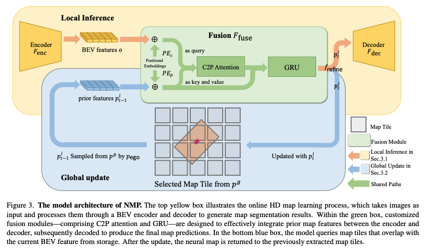

# Neural Map Prior for Autonomous Driving (CVPR 2023)


### [](https://arxiv.org/abs/2304.08481) | [CVF Paper](https://openaccess.thecvf.com/content/CVPR2023/papers/Xiong_Neural_Map_Prior_for_Autonomous_Driving_CVPR_2023_paper.pdf) | [Webpage](https://tsinghua-mars-lab.github.io/neural_map_prior/) | [5-min Video](https://www.youtube.com/watch?v=FpzxaBVw3L0) | [Poster](https://drive.google.com/file/d/1_QfH4biGliakV37st_y-RmvaPsSFugcj/view?usp=sharing) | [Blog](https://zhuanlan.zhihu.com/p/644351344?)

[Xuan Xiong](), [Yicheng Liu](https://scholar.google.com.hk/citations?hl=en&user=vRmsgQUAAAAJ), [Tianyuan Yuan](), [Yue Wang](https://people.csail.mit.edu/yuewang/), [Yilun Wang](https://scholar.google.com.hk/citations?user=nUyTDosAAAAJ&hl=en/), [Hang Zhao*](http://people.csail.mit.edu/hangzhao/)

[//]: # (![github-demo.gif]&#40;figs/github-demo.gif=250*250&#41;)

[//]: # ([![Watch the video]&#40;https://img.youtube.com/vi/OhHGzpQTifo/maxresdefault.jpg&#41;]&#40;https://www.youtube.com/watch?v=OhHGzpQTifo&#41;)

[//]: # (![multi-trip fusion]&#40;figs/github-demo.gif&#41;)

## Table of Contents

- [Introduction](#Introduction)
- [Model Zoo](#Model-Zoo)
- [Installation](#Installation)
- [Getting Started](#Getting-Started)
- [Architecture](#Architecture)
- [Contact](#Contact)
- [Acknowledgements](#Acknowledgements)
- [Citation](#Citation)
- [License](#License)

## Introduction<a name="Intro"></a>

A neural representation of HD maps to improve local map inference performance for autonomous driving.

This repo is the official implementation of __"Neural Map Prior for Autonomous
Driving"__(CVPR 2023). Our main contributions are:

* __A novel mapping paradigm__: integrates the __maintenance of global maps__ and
  the __inference of online local maps__.
* __Efficient fusion modules__:  __current-to-prior attention__ and __gated recurrent unit__ modules facilitate
  the efficient fusion of global and local map features.
* __Easy integration with HD map learning methods__: Neural Map Prior can be easily applied to various map segmentation
  and detection methods. Simple replacement for your online map inference model in your novel algorithms. Moreover, our
  approach demonstrates significant advancements in challenging scenarios, such as __bad weather conditions__
  and __longer perception ranges__.
* __Sparse map tiles__: a memory-efficient approach for storing neural representations of city-scale HD maps.

Notes

* The most challenging part of the training and testing process is distributing the appropriate map tile to each GPU and
  keeping samples in the same map tiles updated on the same GPU. This process includes two steps:
    1. Determine the map tile for each GPU. This can be done with some functions
       in `project/neural_map_prior/map_tiles/lane_render.py`.
    2. Rewrite the sampler so that each GPU can only sample the samples in the map tile assigned to it. This can be done
       in `tools/data_sampler.py`.

## Model Zoo

We experiment with BEVFormer, lift-spat-shoot, HDMapNet and VectorMapNet architectures on nuScenes.

### HD semantic map [BEVFormer] (on nuScenes validation)

|                               Model Config                               | Modality | Divider | Crossing | Boundary | All(mIoU) |                                       Checkpoint Link                                       |
|:------------------------------------------------------------------------:|:--------:|:-------:|:--------:|:--------:|:---------:|:-------------------------------------------------------------------------------------------:|
|            [BEVFormer](project/configs/bevformer_30m_60m.py)             |  Camera  |  49.20  |  28.67   |  50.43   |   42.76   | [model](https://drive.google.com/file/d/1OPiyPl7GbnopDL56D4dgXAW9Dbl1wGko/view?usp=sharing) |
| [BEVFormer + NMP](project/configs/neural_map_prior_bevformer_30m_60m.py) |  Camera  |  54.20  |  34.52   |  56.94   |   48.55   | [model](https://drive.google.com/file/d/1qPvhDICbaNVs86K-n8x1NRfyLylI_xFm/view?usp=sharing) |

## Installation

Please check [installation](docs/installation.md) for installation and [data_preparation](docs/data_preparation.md) for
preparing the nuScenes dataset.

[//]: # (* As part of this code release we have installed this software and run the training and evaluation scripts on a new AWS)

[//]: # (instance to verify the installation process described below.)

## Getting Started

Please check [getting_started](docs/getting_started.md) for training, evaluation, and visualization of neural_map_prior.

## Architecture



## Contact

Any questions or suggestions are welcome!

* __Xuan Xiong__ [abby.xxn@outlook.com](abby.xxn@outlook.com)

## Acknowledgements

We would like to thank all who contributed to the open-source projects listed below. Our project would be impossible to
get done without the inspiration of these outstanding researchers and developers.

* BEV
  Perception: [BEVFormer](https://github.com/fundamentalvision/BEVFormer), [Lift, Splat, Shoot](https://github.com/nv-tlabs/lift-splat-shoot)
* HD Map
  Learning: [HDMapNet](https://github.com/Tsinghua-MARS-Lab/HDMapNet), [VectorMapNet](https://github.com/Mrmoore98/VectorMapNet_code/tree/mian)
* Vision
  Transformer: [Swin Transformer](https://github.com/microsoft/Swin-Transformer)
* [open-mmlab](https://github.com/open-mmlab)

The designate `project/neural_map_prior` as a module is inspired by the implementations
of [DETR3D](https://github.com/WangYueFt/detr3d).

## Citation

If you find neural_map_prior useful in your research or applications, please consider citing:

```
@inproceedings{xiong2023neuralmapprior,
  author  = {Xiong, Xuan and Liu, Yicheng and Yuan, Tianyuan and Wang, Yue and Wang, Yilun and Zhao Hang},
  title   = {Neural Map Prior for Autonomous Driving},
  journal = {Proceedings of the IEEE/CVF International Conference on Computer Vision (CVPR)},
  year    = {2023}
}
```

## License

This project is licensed under the [Apache 2.0 license](LICENSE).

